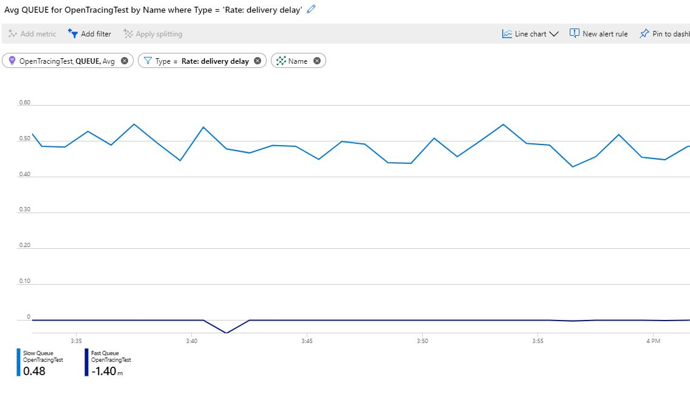
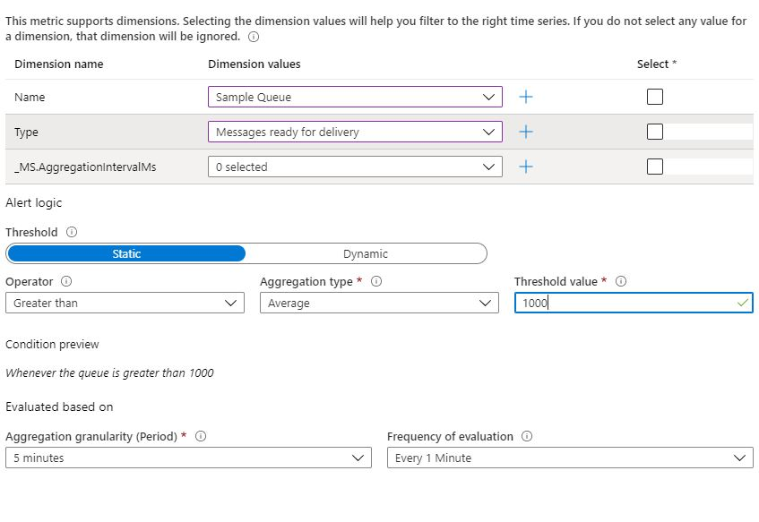

# RabbitMQ Azure Application Insights Metrics Collector
Collects metrics from RabbitMq and publishes them into an App Insight instance on Azure. The metric collector is pulling metrics from a RabbitMQ instance, parses them and publishes them using different custom dimensions. 

The code is accesses the [RabbitMQ management HTTP API](https://rawcdn.githack.com/rabbitmq/rabbitmq-management/v3.8.2/priv/www/api/index.html). Not all metrics that this API exposes are currently collected. See [Collected Metrics](#collected-metrics)

## Build status
| Service Environment      | Status |
| ---                      | ---    |
| Master                   | |

## Supported Versions
This code was tested against management version of RabbitMQ 3.8.2. Other versions might work unless RabbitMQ changes the API format of the management metrics API.

## Prerequisites
1. [RabbitMQ](#rabbitmq) instance with the [Managment Plugin](https://www.rabbitmq.com/management.html)
2. Application Insights
3. Docker (you can host the publisher anywhere, docker is what this setup provides)
4. The Application Insights has to be setup in a [region that supports Custom Metrics](https://docs.microsoft.com/en-us/azure/azure-monitor/platform/metrics-custom-overview#supported-regions)

## Configuration options
| Name              | Description | Default |
| ---               | ---         | ---     |
| **RabbitMqHost**      | RabbitMQ host name - this has to be reachable by the collector | localhost |
| **RabbitMqUserName**  | Username that will be used to access the management API (get this from your RabbitMQ setup)| guest |
| **RabbitMqPassword**  | Pasword that will be used to access the management API (get this from your RabbitMQ setup)| guest |
| **AppInsightsKey**  | Instrumentation Key obtained from your Application Insights instance on Azure| - |
| **UseSSL**  | Set to true if your management API is secured using SSL otherwise false| false |
| **PollingInterval**  | The interval that is used to fetch the values from the management API in milliseconds | 5000 |

The values can be set in the appsettings.json file or set as environment variables (for docker you can use the --env syntax)

# Setup
## RabbitMQ
1. docker run -d --hostname localhost --name local-rabbit -p 15672:15672 -p 5672:5672 rabbitmq:3-management
2. validate you can access the management portal by pointing your browser to http://localhost:15672 (username: guest, password: guest)

## Application Insights
1. Open your azure portal
2. Create a Resource -> Application Insights
3. Select Subscription, Resource Group, a Region and chose a name -> Review + Create
5. Once the Application Insights is created, open it and copy the Instrumentation Key from the Overview Tab
6. Select Usage and estimated Cost
7. Click on "**Custom metrics Preview**" -> Check "Enable alerting on custom metric dimensions" -> Save

**IMPORTANT** without step number 7, the metrics won't show up and you can't use any of the data to setup alerts.

## Metrics collector
1. docker run -d --link local-rabbit --env AppInsightsKey={your app insights key} --name metrics-collector pschuler/rabbitmqmetricspublisher:latest
2. check the logs of the metrics collector. You should see that it started the processor

## Start publishing messages
You can write your own pub/sub or you can use the example in Examples/StatsGenerator to publish and subscribe to a fanout/queue in the local RabbitMQ instance. **Note**: this only works, if you are using the above configuration of a local RabbitMQ installation.

## Validate
Once you started publishing messages you can verify the metrics in Application Insights you created [here](#application-insights).
1. Open your Application Insights instance in Azure portal
2. Select Metrics from the Menu
3. Select rabbitmq from the "Metric Namespace" drop down (**Note:** if it does not yet appear, give it some time to publish the first metrics)
4. Select "Exchange" from the "Metric" drop down

# Using the metrics

## Using custom metrics
You can use the published custom metrics to filter on the metric type and split on the queue name:
1. Select "Queue" from the "Metric" drop down
2. Click on "Add Filter", select "Type" and then select a metric type from the "VALUES" drop down (for example "Rate: Message publishing")
3. Now you should only see the values for that particular metric
4. If you have multiple queues, you can see that particular metric per queue, by adding a split on the name (Apply splitting).

Here is an example of a metric split by queue name:

## Configure alerts
Most likely, you want to add alerts that trigger, when a certain metric is reaching a specific value over time. This can be done using Alerts in Azure. 

1. Open the Alerts menu (you can reach it through your Application Insights menu)
2. Click on "New alert rule"
3. Make sure the right Application Insights instance is selected (the one you created [here](#application-insights))
4. Under "CONDITION" select Add
5. Find the Queue, Exchange, ChurnRates (Signal type "Metric") - you may have to scroll to the next page.
6. Select the one that contains the metric you want to alert on
7. Select the dimension you want to alert on (specific type, specific queue)
8. Configure the threshold you need
9. Go through the other steps required to alert you on the desired channel

# Collected Metrics
Currently those metrics are being collected
## Churn Rate Metrics
RabbitMQ Path | Description
------------ | -------------
channel_closed | Total channels closed
channel_created | Content in the second column
connection_closed | Total channels created
connection_created | Total connections closed
queue_created | Total queues created
queue_declared | Total queues declared
queue_deleted | Total queues deleted

## Exchange Metrics
RabbitMQ Path | Description
------------ | -------------
message_stats.publish_in | Messages published in
message_stats.publish_in_details.rate | Rate of messages published in
message_stats.publish_out | Messages published out
message_stats.publish_out_details.rate | Rate of messages published out

## Queue Metrics
RabbitMQ Path | Description
------------ | -------------
consumers | Consumer: Count
consumer_utilisation | Consumer: Utilization
messages | Total number of messages
messages_details.rate | Rate: Total number of messages
messages_ready | Messages ready for delivery
messages_ready_details.rate | Rate: Messages ready for delivery
messages_unacknowledged | Number of unacknowledged messages
messages_unacknowledged_details.rate | Rate: Number of unacknowledged messages
message_stats.ack | Number of messages in ack mode
message_stats.ack_details.rate | Rate: Number of messages in ack mode
message_stats.deliver_get | Messages delivered recently (of all modes)
message_stats.deliver_get_details.rate | Rate: Messages delivered recently (of all modes)
message_stats.get_no_ack | Messages delivered in no-ack mode in response to basic.get
message_stats.get_no_ack_details.rate | Rate: Messages delivered in no-ack mode in response to basic.get
message_stats.publish | Messages published recently
message_stats.publish_details.rate | Rate: Messages published recently
message_stats.redeliver | Count of subset of messages in deliver_get which had the redelivered flag set.
message_stats.redeliver_details.rate | Rate: Count of subset of messages in deliver_get which had the redelivered flag set.

# Calculated Queue Metrics
Calculated Queue Metrics are additional metrics we found useful to have that are being calculated out of other metrics RabbitMQ provides

Name | Description
--- | ---
Rate: delivery delay | Calculates the delay of the delivery (message_stats.deliver_get) relative to the publishing of the messages (message_stats.publish)

